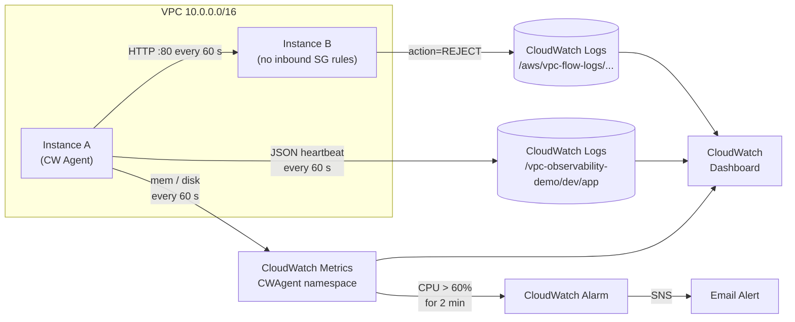
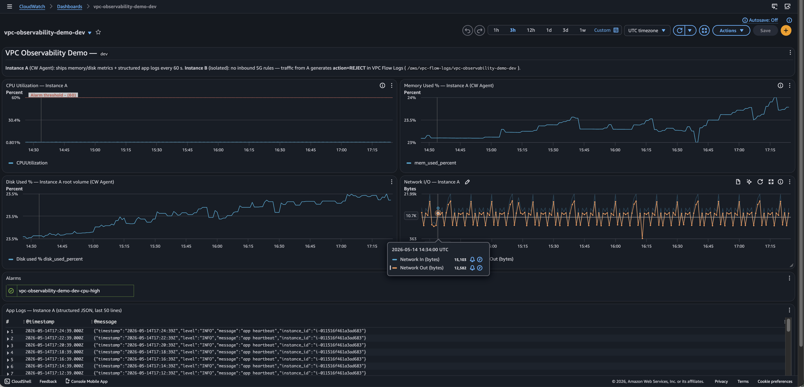
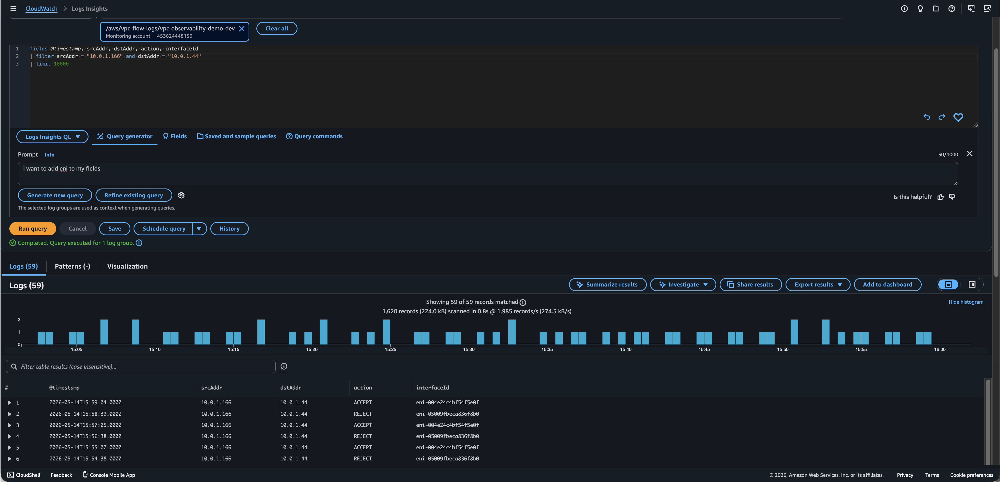
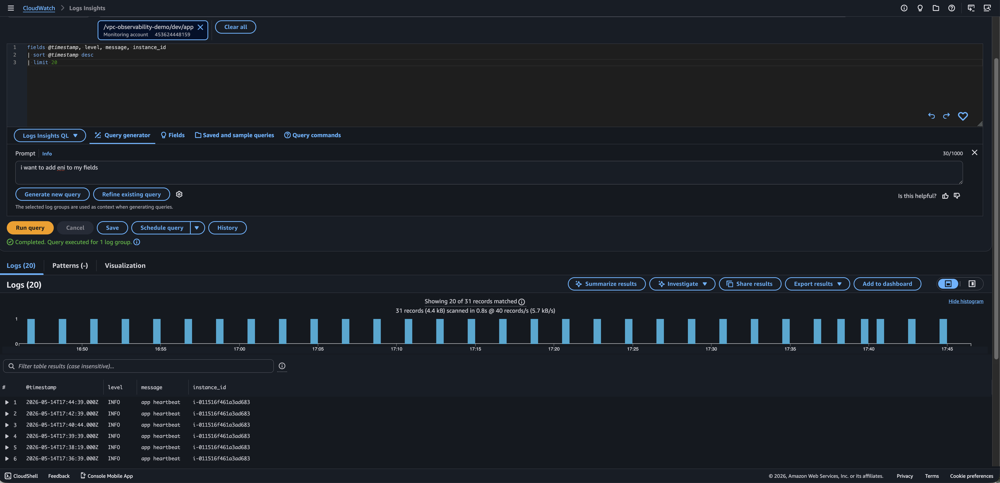
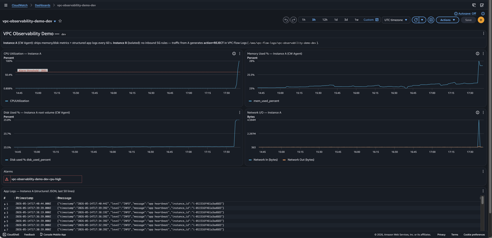
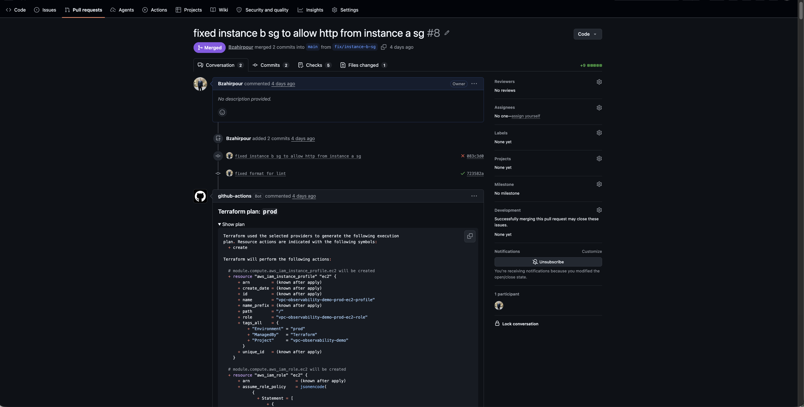
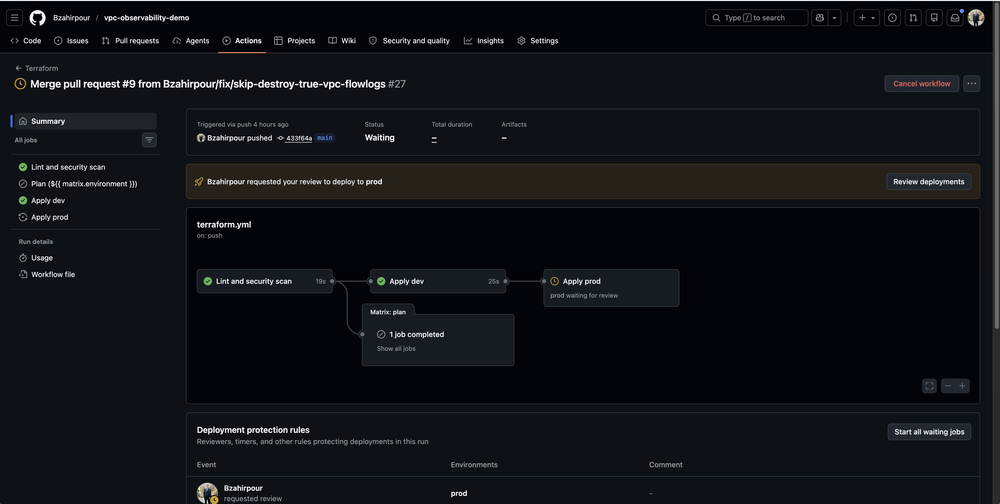

# vpc-observability-demo

[](https://github.com/Bzahirpour/vpc-observability-demo/actions/workflows/terraform.yml)

A production-style AWS observability stack built entirely in Terraform — two EC2 instances, VPC Flow Logs, CloudWatch Agent metrics and structured logging, a live dashboard, and a CPU alarm with SNS email delivery. Deployed automatically via GitHub Actions with OIDC auth and a required prod approval gate.

## What this demonstrates

- **VPC Flow Logs** — all traffic captured to CloudWatch Logs; Instance A probes Instance B every 60 s, generating `action=REJECT` entries that prove security isolation is enforced at the network level
- **CloudWatch Agent** — memory and disk metrics (unavailable in EC2 native) shipped from Instance A to a custom `CWAgent` namespace every 60 s
- **Structured logging** — Instance A writes a JSON heartbeat to `/var/log/app.log`; the agent tails it and ships to CloudWatch Logs Insights where fields are parsed and queryable without a third-party log platform
- **Alerting** — CloudWatch alarm triggers when CPU exceeds 60% for two consecutive minutes; SNS delivers an email and the dashboard alarm panel reflects state in real time
- **GitOps pipeline** — `terraform fmt` + `tflint` + `tfsec` on every commit; `terraform plan` posted as a PR comment for both environments; sequential dev → prod apply with a required prod approval gate; OIDC auth (no stored AWS credentials)

## Architecture



## Screenshots

### Dashboard — steady state



CPU, memory (CW Agent), disk, and network I/O on a single pane. The alarm panel is green and the App Logs widget streams structured JSON heartbeats in real time.

### VPC Flow Logs — ACCEPT and REJECT



Instance A → Instance B traffic filtered in Logs Insights. Two ENI IDs alternate on the same src→dst pair: Instance A's ENI records `ACCEPT` (it is permitted to send), Instance B's ENI records `REJECT` (no inbound SG rule exists). The interleaved result is network-level proof that the isolation is enforced, not just assumed.

### Structured app logs — Logs Insights



The CloudWatch Agent tails `/var/log/app.log` and ships each JSON line to Logs Insights, where `level`, `message`, and `instance_id` are parsed as discrete fields and filterable without any additional log management tooling.

### Dashboard — CPU alarm triggered



`stress-ng --cpu 2` on Instance A pushes utilization past the 60% threshold. After two consecutive 1-minute evaluation periods, the alarm transitions to ALARM state, the dashboard panel turns red, and SNS delivers an email notification.

### CI/CD pipeline — PR plan comment



On every pull request, the pipeline runs `terraform plan` for both `dev` and `prod` and posts the full output as a collapsible comment. Reviewers see exactly what will change before approving — no need to run Terraform locally.

### CI/CD pipeline — deployment pipeline



On push to `main`: lint and security scan (tfsec) → apply dev → apply prod (held behind a required GitHub environment approval). The prod job stays pending until a reviewer explicitly approves the deployment.

## Project structure

```
infra/
├── envs/
│   ├── dev/           # dev workspace — backend, tfvars, module wiring
│   └── prod/          # prod workspace
└── modules/
    ├── networking/    # VPC, subnets, security groups, flow logs, IAM
    ├── compute/       # EC2 instances, IAM role, CW agent userdata
    └── observability/ # log groups, dashboard, alarm, SNS topic
bootstrap/             # S3 backend + DynamoDB lock table (one-time)
.github/workflows/
└── terraform.yml      # lint → plan (PRs) / apply (main) pipeline
```

## Prerequisites

- AWS CLI configured (or `AWS_*` environment variables set)
- Terraform ≥ 1.14
- An S3 bucket and DynamoDB table for remote state — created by `bootstrap/`

## Quick start

### 1. Bootstrap remote state (one-time)

```bash
cd bootstrap
terraform init && terraform apply
```

### 2. Deploy dev

```bash
cd infra/envs/dev
terraform init
terraform apply
```

Enter your email when prompted for `var.alarm_email`, then confirm the SNS subscription that arrives in your inbox before testing alarms.

### 3. Open the dashboard

```bash
terraform output dashboard_url
```

## Demo walkthrough

### 1. Get outputs

After `terraform apply` completes, print the stack outputs — you will need the instance IDs and private IPs throughout this walkthrough:

```bash
terraform output
```

Key values:

| Output | Used for |
|---|---|
| `instance_a_id` | SSM session targets |
| `instance_b_id` | SSM session targets |
| `instance_a_private_ip` | Flow log queries |
| `instance_b_private_ip` | Manual curl tests |
| `dashboard_url` | Open the CloudWatch dashboard |
| `flow_logs_log_group` | Logs Insights source |
| `app_log_group` | Logs Insights source |

### 2. SSM into the instances

No SSH key or bastion is required — both instances have SSM agent running via the attached IAM role.

```bash
# Instance A (CW Agent host)
aws ssm start-session --target $(terraform output -raw instance_a_id)

# Instance B (isolated target)
aws ssm start-session --target $(terraform output -raw instance_b_id)
```

### 3. Confirm nginx is running on Instance B

From an SSM session on Instance B:

```bash
systemctl status nginx
curl -s http://localhost/   # returns nginx welcome page
```

nginx is up and listening on port 80 — the service itself is healthy. The problem demonstrated in the next step is entirely at the network layer.

### 4. Curl Instance B from Instance A — observe the failure

Open an SSM session on Instance A, then attempt to reach Instance B over HTTP:

```bash
curl -v --connect-timeout 3 http://<instance_b_private_ip>/
```

The connection times out. Instance B's security group has no inbound rules, so the SYN packet is dropped and never reaches nginx. This is expected — it is the condition the demo is designed to observe.

### 5. Confirm the REJECT entries in VPC Flow Logs

Wait about one minute after the curl attempt, then run the following in CloudWatch → Logs Insights against the `/aws/vpc-flow-logs/vpc-observability-demo-dev` log group:

```
fields @timestamp, srcAddr, dstAddr, action, interfaceId
| filter srcAddr = "<instance_a_private_ip>"
| sort @timestamp desc
| limit 20
```

You will see alternating `ACCEPT` / `REJECT` rows across two ENI IDs for the same src→dst pair. Instance A's ENI records `ACCEPT` (it is permitted to send), Instance B's ENI records `REJECT` (no inbound rule exists). This is the network-level proof — the isolation is enforced, not assumed.

### 6. Fix the security group

The VPC Flow Log entries give you what you need to diagnose the issue: traffic from Instance A is being rejected at Instance B's security group. To resolve it, add an inbound rule that allows HTTP from the VPC CIDR:

In `infra/modules/networking/main.tf`, add:

```hcl
resource "aws_vpc_security_group_ingress_rule" "b_http_from_a" {
  security_group_id            = aws_security_group.instance_b.id
  description                  = "Allow HTTP from Instance A"
  ip_protocol                  = "tcp"
  from_port                    = 80
  to_port                      = 80
  referenced_security_group_id = aws_security_group.instance_a.id
}
```

Then apply:

```bash
terraform apply
```

### 7. Verify the fix

From Instance A, curl Instance B again:

```bash
curl -v --connect-timeout 3 http://<instance_b_private_ip>/
```

You should get a 200 response from nginx. In Logs Insights, re-run the same query — the entries for Instance B's ENI now show `ACCEPT` instead of `REJECT`.

### 8. Trigger the CPU alarm

From the Instance A SSM session:

```bash
sudo dnf install -y stress-ng
stress-ng --cpu 2 --timeout 120s
```

After two consecutive 1-minute evaluation periods above the 60% threshold, the alarm transitions to ALARM state, the dashboard panel turns red, and SNS delivers an email.

## Cleanup

```bash
cd infra/envs/dev
terraform destroy
```

The VPC flow log group (`/aws/vpc-flow-logs/vpc-observability-demo-dev`) is intentionally retained on destroy (`skip_destroy = true`) to avoid a race condition where AWS recreates the group during cleanup and blocks the next apply. Delete it manually when you are fully done:

```bash
aws logs delete-log-group \
  --log-group-name /aws/vpc-flow-logs/vpc-observability-demo-dev
```
